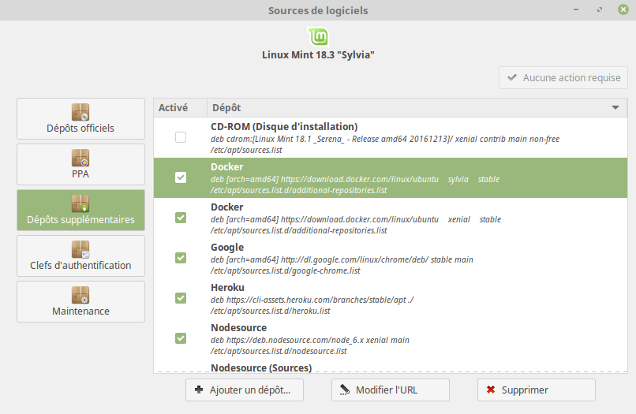

# Docker Install for Linux Mint - Subtlety

Follow the [official tutorial](https://docs.docker.com/install/linux/docker-ce/ubuntu/), it's pretty straightforward.

Though if you're using Linux Mint, you may have a little trouble with the Docker stable repository set up
*(Install Docker CE > Install using the repository > Set up the repository > part 4)*,
especially of you're not familiar with the parenting relations between the differents Ubuntu/Linux Mint releases. :penguin:

As precised in the note, *"in a distribution like Linux Mint, you might need to change $(lsb_release -cs) to your parent Ubuntu distribution"*

Then, do NOT run this command :
```bash
$ sudo add-apt-repository \
   "deb [arch=amd64] https://download.docker.com/linux/ubuntu \
   $(lsb_release -cs) \
   stable"
```
This would add the wrong repository (using the Mint version name), thus making the apt package index update fail miserably  :weary:, and resulting in messages error in your log, like :
```
Err:23 https://download.docker.com/linux/ubuntu sylvia/stable amd64 Packages
  404  Not Found
...
W: The repository 'https://download.docker.com/linux/ubuntu sylvia Release' does not have a Release file.
N: Data from such a repository can't be authenticated and is therefore potentially dangerous to use.
```

Instead, you need to change `$(lsb_release -cs)` to the name of the Ubuntu version that your Mint version is based on.
You can get it from this table : [Ubuntu base name](https://doc.ubuntu-fr.org/linux_mint#versionnage)

For instance, if you're using Linux Mint 18.3 (Sylvia), the command would be :
```bash
$ sudo add-apt-repository \
   "deb [arch=amd64] https://download.docker.com/linux/ubuntu \
   xenial \
   stable"
```

In case you **already added the wrong repository** (or many wrong repositories if you tried with different version names), **delete it/them from your repositories list** in the Update Manager (as incorrect repositories names will cause the update to fail) :


Once you only have the correct Docker repository in your list, you can now smoothly run the update :
```bash
$ sudo apt-get update
```
tadaaaa :tada:

You can now follow the next steps of the doc tutorial to finish the installation :whale:
